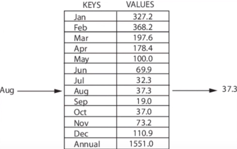

<iframe height="315" src="https://www.youtube.com/embed/_1BPrCHcjhs" frameborder="0" allowfullscreen></iframe>
  
[程式碼來源/ 教學程式碼](https://codepen.io/beaucarnes/pen/jBjobG?editors=0012)
  

## 概念簡述
- Map儲存一連串的鍵值對(kay-value pair)，取值時透過特定的鍵(key)去取得特定的值(value)，若用生活例子來比喻，則像小學班級的學生編號，1號是小明，2號是小健...等，點名時若點到1號，則小明同學就會喊"右!",例子中的編號就像是鍵(key),相對應的學生則是值(value)
  
- 影片中提到的例子，透過月份名稱取得欲取得的值:
{:class="img-responsive"}

  
## 基礎結構
Javascript裡的陣列已實作Map物件，但仍可自己實作Stack

1. Javascript的Map物件使用範例
```javascript
	let map2 = new Map();
	map2.has('hands');
	map2.entries();

	let keyObj = {},
		keyFunc = function() {};

	map2.set('hello', 'string value');
	map2.set(keyObj, 'obj value');
	map2.set(keyFunc, 'func value');
	map2.set(NaN, 'NaN value')

	console.log(map2.size);

	console.log(map2.get('hello'));
	console.log(map2.get(keyObj));
	console.log(map2.get(keyFunc));
	console.log(map2.get(NaN));

	// 4
	// "string value"
	// "obj value"
	// "func value"
	// "NaN value"
```

2. Map方法
- size Map元素總數  
- set  加入新元素
- has 確認是否有特定元素
- get  回傳特定元素
- delete  刪除特定元素
- values  回傳所有元素的值
- clear 清除所有元素
  
## 實作步驟
1. 建立物件，加入count和collection屬性
```javascript
var myMap = function() {
    this.collection = {};  // Stack元素
    this.count = 0;  // Stack長度
}
```
  
2. 實作size方法
```javascript
...
	this.size = function() {
		return this.count;
	};
...
```

3. 實作set方法
```javascript
...
	this.set = function(key, value) {
		this.collection[key] = value;
		this.count++;
	};
...
```

4. 實作has方法
```javascript
...
	this.has = function(key) {
		return (key in this.collection);
	};
...
```

5. 實作get方法
```javascript
...
	this.get = function(key) {
		return (key in this.collection) ? this.collection[key] : null;
	};
...
```

6. 實作delete方法
```javascript
...
	this.delete = function(key) {
		if (key in this.collection) {
			delete this.collection[key];
			this.count--;
		}
	};
...
```

7. 實作values方法
```javascript
...
	this.values = function() {
		let result = new Array();
		for (let key of Object.keys(this.collection)) {
			result.push(this.collection[key]);
		};
		return (result.length > 0) ? result : null;
	};
...
```

8. 實作clear方法
```javascript
...
	this.clear = function() {
		this.collection = {};
		this.count = 0;
	};
...
```

9. 即完成,完整程式碼如下:
```javascript
let myMap = function() {
	this.collection = {};
	this.count = 0;
	this.size = function() {
		return this.count;
	};
	this.set = function(key, value) {
		this.collection[key] = value;
		this.count++;
	};
	this.has = function(key) {
		return (key in this.collection);
	};
	this.get = function(key) {
		return (key in this.collection) ? this.collection[key] : null;
	};
	this.delete = function(key) {
		if (key in this.collection) {
			delete this.collection[key];
			this.count--;
		}
	};
	this.values = function() {
		let result = new Array();
		for (let key of Object.keys(this.collection)) {
			result.push(this.collection[key]);
		};
		return (result.length > 0) ? result : null;
	};
	this.clear = function() {
		this.collection = {};
		this.count = 0;
	};
};
```


  
## 使用範例
```javascript
  let map = new myMap();
  map.set('arms', 2);
  map.set('fingers', 10);
  map.set('eyes', 2);
  map.set('belley button', 1);

  console.log(map.get('fingers'));
  console.log(map.size());
  console.log(map.values());

  // 10
  // 4
  // [2, 10, 2, 1]
```

