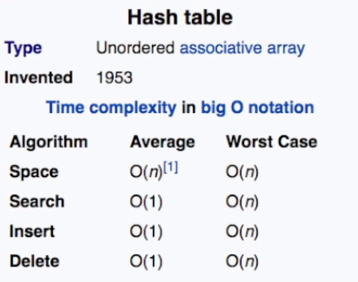
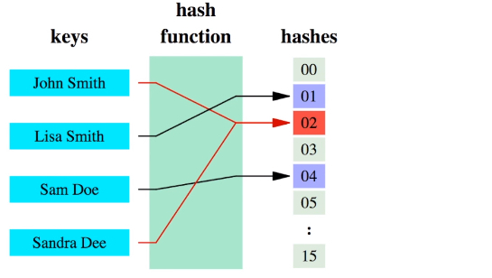
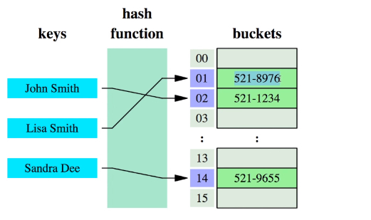

<iframe height="315" src="https://www.youtube.com/embed/F95z5Wxd9ks" frameborder="0" allowfullscreen></iframe>
  
[程式碼來源/ 教學程式碼](https://codepen.io/beaucarnes/pen/VbYGMb?editors=0012)
  

## 概念簡述
- // 敘述待補  
{:class="img-responsive"}  
{:class="img-responsive"}
{:class="img-responsive"}

## 基礎結構
HashTable方法
- print Map元素總數  
- add  加入新元素
- remove 確認是否有特定元素
- lookup

## 實作步驟
1. 定義hash方法
```javascript
var hash = (string, max) => {
  var hash = 0;
  for (var i = 0; i < string.length; i++) {
    hash += string.charCodeAt(i);
  }
  return hash % max;
};
```

2. 建立物件，加入storage和storageLimit變數
```javascript
var myMap = function() {
  let storage = [];
  const storageLimit = 14;
}
```

3. 實作print方法
```javascript
...
  this.print = function() {
    console.log(storage)
  }
...
```

4. 實作add方法
```javascript
...
  this.add = function(key, value) {
    var index = hash(key, storageLimit);
    if (storage[index] === undefined) {
      storage[index] = [
        [key, value]
      ];
    } else {
      var inserted = false;
      for (var i = 0; i < storage[index].length; i++) {
        if (storage[index][i][0] === key) {
          storage[index][i][1] = value;
          inserted = true;
        }
      }
      if (inserted === false) {
        storage[index].push([key, value]);
      }
    }
  };
...
```

5. 實作remove方法
```javascript
...
  this.remove = function(key) {
    var index = hash(key, storageLimit);
    if (storage[index].length === 1 && storage[index][0][0] === key) {
      delete storage[index];
    } else {
      for (var i = 0; i < storage[index].length; i++) {
        if (storage[index][i][0] === key) {
          delete storage[index][i];
        }
      }
    }
  };
...
```
  
6. 實作lookup方法
```javascript
...
  this.lookup = function(key) {
    var index = hash(key, storageLimit);
    if (storage[index] === undefined) {
      return undefined;
    } else {
      for (var i = 0; i < storage[index].length; i++) {
        if (storage[index][i][0] === key) {
          return storage[index][i][1];
        }
      }
    }
  };
...
```

7. 即完成,完整程式碼如下:
```javascript
    var hash = (string, max) => {
    var hash = 0;
    for (var i = 0; i < string.length; i++) {
        hash += string.charCodeAt(i);
    }
    return hash % max;
    };

    let HashTable = function() {

    let storage = [];
    const storageLimit = 14;
    
    this.print = function() {
        console.log(storage)
    }

    this.add = function(key, value) {
        var index = hash(key, storageLimit);
        if (storage[index] === undefined) {
        storage[index] = [
            [key, value]
        ];
        } else {
        var inserted = false;
        for (var i = 0; i < storage[index].length; i++) {
            if (storage[index][i][0] === key) {
            storage[index][i][1] = value;
            inserted = true;
            }
        }
        if (inserted === false) {
            storage[index].push([key, value]);
        }
        }
    };

    this.remove = function(key) {
        var index = hash(key, storageLimit);
        if (storage[index].length === 1 && storage[index][0][0] === key) {
        delete storage[index];
        } else {
        for (var i = 0; i < storage[index].length; i++) {
            if (storage[index][i][0] === key) {
            delete storage[index][i];
            }
        }
        }
    };

    this.lookup = function(key) {
        var index = hash(key, storageLimit);
        if (storage[index] === undefined) {
        return undefined;
        } else {
        for (var i = 0; i < storage[index].length; i++) {
            if (storage[index][i][0] === key) {
            return storage[index][i][1];
            }
        }
        }
    };

    };
```


  
## 使用範例
```javascript
console.log(hash('quincy', 10))

let ht = new HashTable();
ht.add('beau', 'person');
ht.add('fido', 'dog');
ht.add('rex', 'dinosour');
ht.add('tux', 'penguin')
console.log(ht.lookup('tux'))
ht.print();

  // 5
  // "penguin"
  // [undefined,undefined,undefined,[[tux,penguin]],undefined,undefined,undefined,[[beau,person]],undefined,undefined,undefined,undefined,[[fido,dog]],[[rex,dinosour]]]
```

